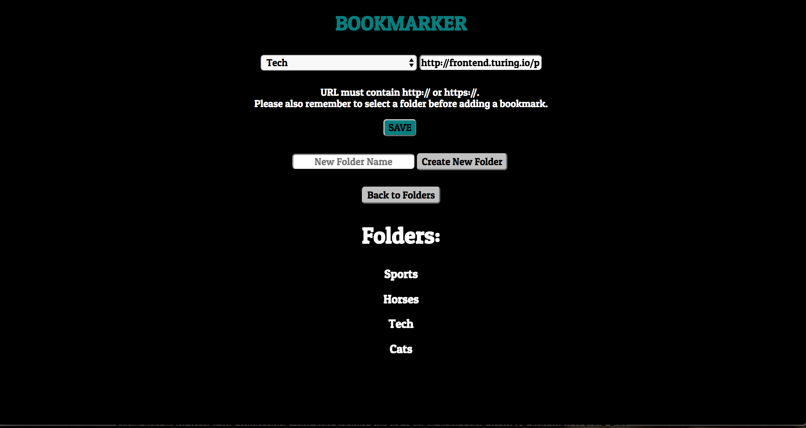

##Jet Fuel

Created by: Graham Nessler and Kristen Burgess

[Check it out!](https://kbgn-jetfuel.herokuapp.com/)

This is a URL shortening service built using Postgres, SQL, jQuery, Express.js, and Node.js. The user enters in folder names to store URLs and then enters in URLs in specified folders. The application then generates a shortened URL for each URL the user enters. These are grouped by folders in the UI, which the user can navigate. The user can also sort URLs by date added and popularity (number of clicks). The data persists in a Postgres database.

[Project specs](http://frontend.turing.io/projects/jet-fuel.html)
